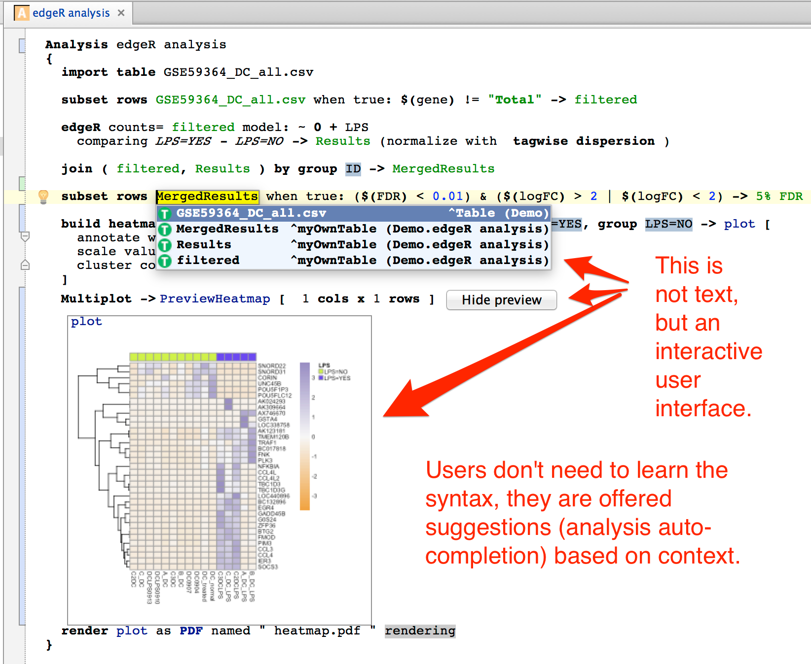
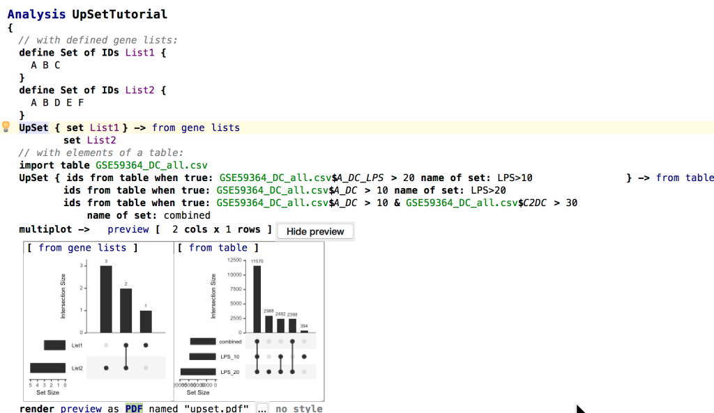

MetaR takes advantage of Language Workbench Technology to facilitate data analysis with the R language. It can be used by:

* biologists with limited computational experience. No programming skills are required to start analyzing data.
* bioinformaticians who need to perform repetitive analyses and find it beneficial to design and use specialized analyses micro-languages to increase productivity and consistency of data analysis.
* bioinformaticians who wish to package state of the art analysis methods into user friendly metaR analysis language constructs. MetaR can act as a bridge between analysis experts who develop analysis methods in R and wish to distribute these methods to the broadest audience without investing a lot of effort in developing user interfaces.

MetaR is designed to work well with other languages of the platform. Importantly, users who learn how to use one component will acquire skills useful with other languages offered on the platform.

The following snapshot illustrates how metaR simplifies data analysis: we call differentially expressed genes with edgeR, join the resulting table with the table of counts, and produce a heatmap for the top 5% differentially regulated genes:
 
{:height="60%" width="60%"}

Here’s another example showing how to look at intersection of gene lists with the integration of UpSetR/MetaR integration:

{:height="60%" width="60%"}

# Some Key Features of MetaR

## Data Manipulation
* High-level data abstractions
* Advanced assistance in manipulating data
    * [Reorder columns](https://github.com/manuelesimi/MetaR-demos/tree/master/solutions/DataManipulation)
* Inspection of data and results in an integrated environment

## Execution
* Analysis execution without prior knowledge of the R language
* Seamless integration with Docker for reproducibility

## Graphical Visualizations
* Box plot (a graph that gives you a good indication of how the values in the data are spread out)
* Histogram (a graph representing the frequencies of values of a variable bucketed into continuous ranges)
* Scatter plot (a graph of plotted points that show the relationship between two sets of data.)
* [Heatmap](https://github.com/manuelesimi/MetaR-demos/tree/master/solutions/DifferentialExpressions) (a graphical representation of data where the individual values contained in a matrix are represented as colors)
* Venn Diagram (commonly used to illustrate levels of overlap between groups in data)
* UpSet plot (a modern alternative to Venn Diagrams and make it easy and effective to compare intersection of several sets of items)
* [MA Plot](https://github.com/manuelesimi/MetaR-demos/tree/master/solutions/QC) (a type of quality control plot useful when looking at high-throughput gene expression assays)
* T-SNE plots (scatter plots following T-SNE dimensionality reduction)
* Multi plot (makes it possible to organize other plots in a matrix of n columns by n rows)

## Styles
* Definition of [styles](https://github.com/manuelesimi/MetaR-demos/tree/master/solutions/Styles) to customize the graphical aspects of plots and files generated by statements

