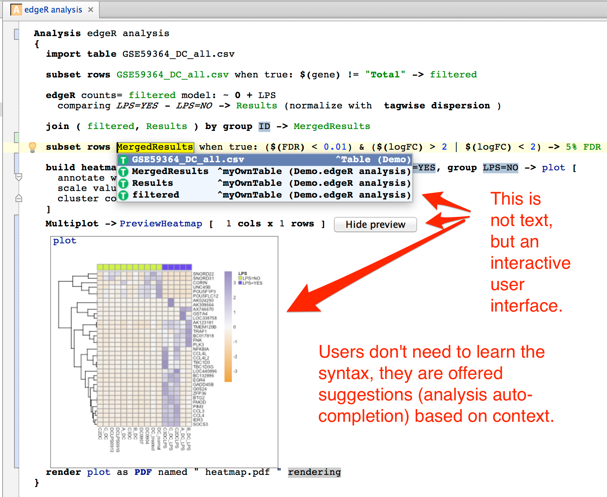

# MetaR

MetaR takes advantage of Language Workbench Technology to facilitate data analysis with the R language. It can be used by:

* biologists with limited computational experience. No programming skills are required to start analyzing data.
* bioinformaticians who need to perform repetitive analyses and find it beneficial to design and use specialized analyses micro-languages to increase productivity and consistency of data analysis.
* bioinformaticians who wish to package state of the art analysis methods into user friendly metaR analysis language constructs. MetaR can act as a bridge between analysis experts who develop analysis methods in R and wish to distribute these methods to the broadest audience without investing a lot of effort in developing user interfaces.

MetaR is designed to work well with other languages of the platform. Importantly, users who learn how to use one component will acquire skills useful with other languages offered on the platform.

The following snapshot illustrates how metaR simplifies data analysis: we call differentially expressed genes with edgeR, join the resulting table with the table of counts, and produce a heatmap for the top 5% differentially regulated genes:

MetaR can be installed on the following platforms:
* MacOS Sierra 10.12+
* 64bit Windows 10 Pro, Enterprise and Education (1607 Anniversary Update, Build 14393 or later)
* Any Linux distribution supporting Java 8 (check here for a complete list)

## Installation or upgrade

To install MetaR, see installation instructions for each supported platform: 

[Installation instructions for MacOS users](macos/README.md).

Installation instructions for Windows users (TBP).

Installation instructions for Linux users (TBP).

To upgrade MetaR, use the MPS&gt;Preferences...&gt;Plugins dialog. MPS will notify you of available upgrades. Follow instructions to install the new version of the plugin.

## Binary distribution
Binary packages of MetaR are available at the [JetBrains MPS Plugins Repository](https://plugins.jetbrains.com/plugin/7621-org-campagnelab-metar).

## Releases and change log
See [MetaR releases](https://github.com/manuelesimi/MetaR/releases) on GitHub.

## License
MetaR is open-source and released under the [Apache 2.0 license](http://www.apache.org/licenses/LICENSE-2.0).