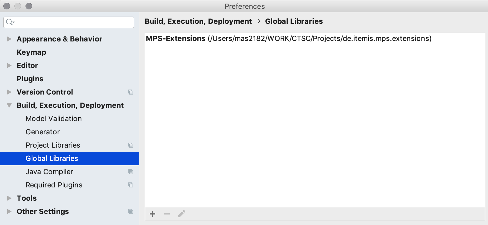

# MetaR Development Pages 

## Dependencies

### MPS Extensions 
[MPS Extensions](https://jetbrains.github.io/MPS-extensions/) plays a key role in MetaR. 

## Migration to MPS 2019.1.5 

### Installation

In the plugins page, install the following plugins:
* RichText
* de.slisson.mps.all

### Pre-releases
Sometimes MPS Extensions are not yet available as binary plugins for MPS in the repository.

Pre-releases are available at the [github repository](https://github.com/JetBrains/MPS-extensions). 

MetaR 2.5.x has been tested with the following pre-release:

https://github.com/JetBrains/MPS-extensions/releases/download/nightly-2019.1.1069.f2ac5fb/de.itemis.mps.extensions-2019.1.1069.f2ac5fb.zip

Extract the archive and point a project or global library in MPS to the location where you extracted it: 

   {:height="80%" width="80%"}
        
