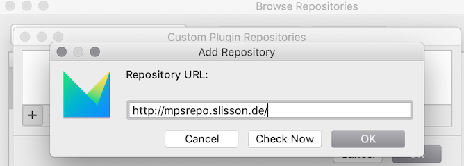
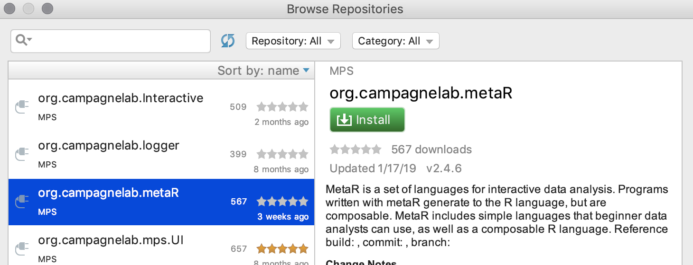
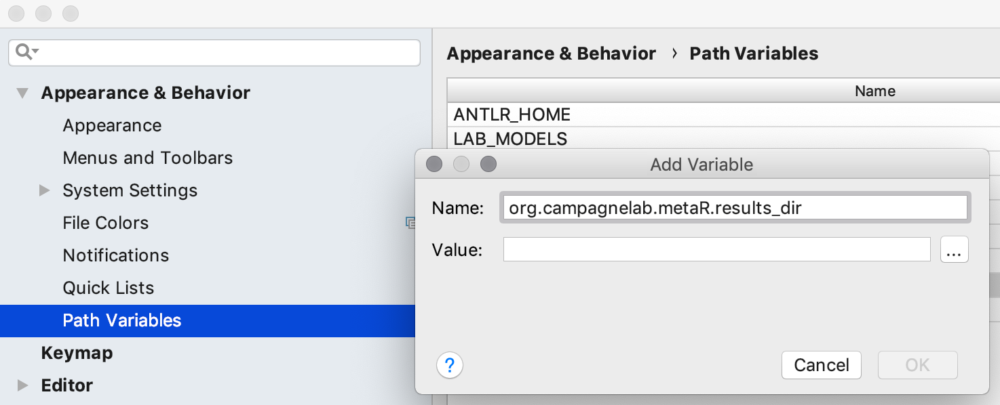
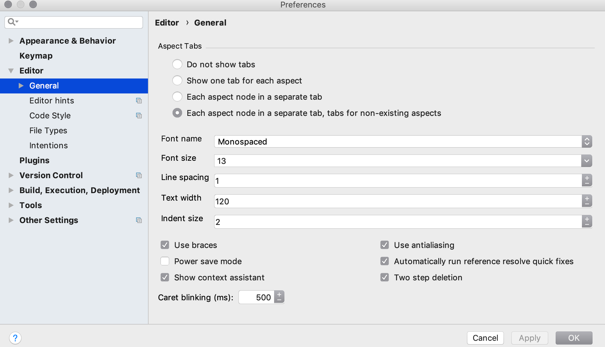

## Installation instructions for MacOS users

System requirements
-
[MetaR](https://github.com/manuelesimi/MetaR) can be installed only if these requirements are met:
* macOS Sierra 10.12+
* about 4GB of disk space available.

Install software required by MetaR
-
1. Download and install Jetbrains MPS 2018.1.1 bundled with Java 8 (205 MB) from https://download.jetbrains.com/mps/2018.1/MPS-2018.1.1-macos-jdk-bundled.dmg

2. Install Docker Community Edition from [https://store.docker.com/search?type=edition&offering=community]()https://store.docker.com/search?type=edition&offering=community) (you need to register for the download). 

    Depending on your machine’s system, follow the simple steps described on the download page to activate Docker on your system. Then, from the Terminal application (or command prompt in Windows), type the following command:

        docker pull artifacts/metar:latest

    then press enter/return. This will download a docker image we will use to execute MetaR analyses.
   
Install MetaR
-    
1. Install the MPS metaR plugin
    
    3.1 Start the MPS application and open-up the plugin manager in MPS (menu MPS > Preferences… > Plugins)
    
    3.2 click on the “Browse Repositories…” button.
    
    3.3 In the new window, click on the “Manage Repositories…” button, then + (plus) and add the following URL: http://mpsrepo.slisson.de/
    
    
2. Back on the “Browse Repositories…” window, scroll the list of available plugins and install the plugin _org.campagnelab.MetaR_. Restart the application to activate the plugin.
    

Configuration
-    

1. Define the following Path Variable (menu MPS&gt;Preferences...&gt;Appearance &amp; Behavior&gt;Path Variables):
    * **Name**: _org.campagnelab.metaR.results_dir_
    * **Value**: an arbitrary folder <strong>under /Users in Mac OS X </strong>where you want the results of MetaR analyses to be placed. (This directory is
                    empty the first time you start MetaR.)
    

2. Enable automatic reference re-resolution in the editor. For that, you need to enable the corresponding flag
   on the Editor page in the Project settings (menu MPS&gt;Preferences...&gt;Editor&gt; General) as shown: 
   
   
