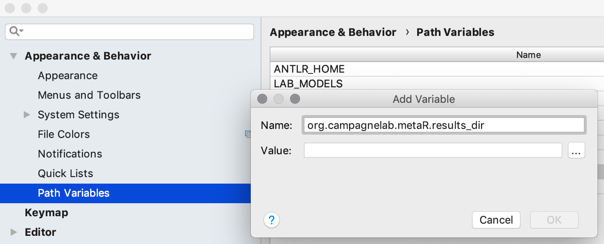

## Installation instructions for Linux users

System requirements
-
[MetaR](https://manuelesimi.github.io/MetaR/) can be installed only if these requirements are met:

* GNOME or KDE desktop
* 3 GB RAM minimum, 8 GB RAM recommended
* 2.5 GB hard disk space, SSD recommended
* 1024x768 minimum screen resolution

Install software required by MetaR
-
1. Download and install Jetbrains MPS 2019.1.5 from [https://download.jetbrains.com/mps/2019.1/MPS-2019.1.5.tar.gz](https://download.jetbrains.com/mps/2019.1/MPS-2019.1.5.tar.gz)

2. Install Docker Community Edition from [https://store.docker.com/search?type=edition&offering=community](https://store.docker.com/search?type=edition&offering=community) (you need to register for the download). 

    Depending on your machine’s system, follow the simple steps described on the download page to activate Docker on your system. Then, from the Terminal application, type the following command:

        docker pull artifacts/metar:latest

    then press enter/return. This will download a docker image we will use to execute MetaR analyses.
   
Install MetaR
-    
1. Install the MPS metaR plugin
    
    1.1 Start the MPS application and open-up the plugin manager in MPS (menu MPS > Preferences… > Plugins)
    
    1.2 Click on the top-right gear image and then select “Manage Plugin Repositories…” from the menu.
    
    {:height="50%" width="50%"}

    1.3 In the new window, click on the “+” button and add the following URL: http://mpsrepo.slisson.de/
  
    {:height="50%" width="50%"}
    
2. Back on the “Plugins” window, click on "Marketplace" and search for "MetaR" and click on the install button of the plugin _org.campagnelab.MetaR_. Restart the application to activate the plugin.
  
    {:height="30%" width="60%"}
    
3. After restarting, open MPS, go back in the plugin manager (menu MPS > Preferences… > Plugins), select the "Installed" tab, and make sure the MetaR plugin is not listed red.     
   
    {:height="50%" width="50%"}
    
Configuration
-    

1. Define the following Path Variable (menu MPS&gt;Preferences...&gt;Appearance &amp; Behavior&gt;Path Variables):
    * **Name**: _org.campagnelab.metaR.results_dir_
    * **Value**: an arbitrary folder <strong>under /home/your user  </strong>where you want the results of MetaR analyses to be placed. (Avoid a path with spaces.)
  
    {:height="80%" width="80%"}

2. Enable automatic reference re-resolution in the editor. For that, you need to enable the corresponding flag ("Automatically run reference resolve quick fixes")
   on the Editor page in the Project settings (menu MPS&gt;Preferences...&gt;Editor&gt; General) as shown: 
   
   {:height="90%" width="90%"}
